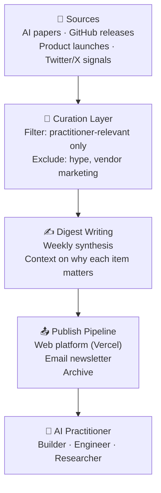

# aitechdigest

> Curated weekly digest for AI practitioners — synthesizing what actually matters in the fast-moving AI tool landscape.

A practitioner-first newsletter and web platform for following AI tools, frameworks, and techniques without drowning in noise. Each issue curated by someone who builds with AI daily.

---

## What it was

---

## Content categories

| Category | What it covered |
|---|---|
| New models + releases | What changed, who it affects, what to test |
| Dev tools | SDKs, frameworks, CLIs worth trying |
| Agent infrastructure | Memory, orchestration, eval frameworks |
| Business / ops AI | Automation tools for non-ML use cases |
| Research highlights | Papers with practical implications |

---

## Stack

| Layer | Tech |
|---|---|
| Frontend | Next.js + React |
| Deployment | Vercel |
| Content store | Markdown + git |
| Email | Newsletter platform API |

---

## Status

AITechDigest is archived. The curation lens — what matters for practitioners building with AI, not researchers training models — informed the product direction of [Ownly](https://ownlyagent.com) and the tooling philosophy behind [company-brain](https://github.com/joydai2026-del/company-brain) and [dream-management](https://github.com/joydai2026-del/dream-management).

---

Built by [Joy Dong](https://joydong.org)
